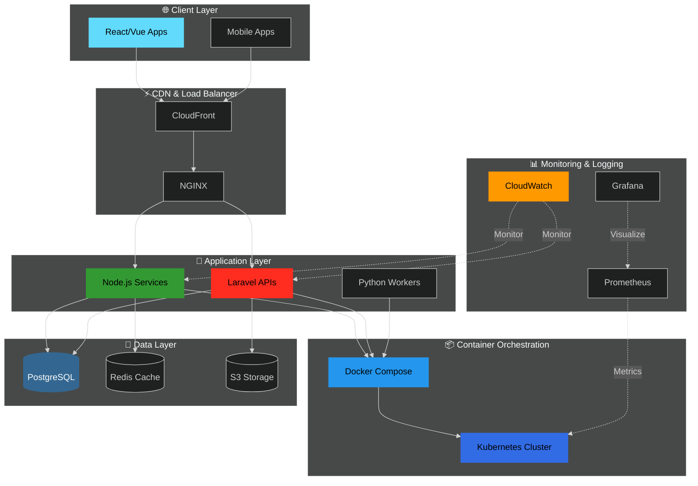

<!-- Header Banner -->
<div align="center">
  


</div>

<!-- Typing Animation -->
<p align="center">
  
</p>

<!-- Social Badges -->
<p align="center">
  <a href="https://www.linkedin.com/in/widane-vihaga12/">
    
  </a>
  <a href="https://medium.com/@widanevihaga">
    
  </a>
  <a href="https://sahansara.github.io/">
    
  </a>
  
</p>

---

<!-- About Section with Modern Cards -->
<div align="center">

## 🚀 DevOps Engineer & Full-Stack Developer

</div>

```typescript
const vihaga = {
  location: " Colombo, Sri Lanka",
  education: "🎓 ICT @ University of Colombo",
  current_focus: [
    "Building cloud native applications",
    "Designing CI/CD pipelines",
    "Infrastructure as Code",
    "Container orchestration"
  ],
  architecture: ["Microservices", "Event Driven", "Serverless"],
  life_motto: "Automate everything, monitor constantly, improve iteratively 🔄"
};
```

---

<!-- CI/CD Pipeline Visualization -->
<div align="center">

## 🔄 My DevOps Pipeline

```mermaid
%%{init: {'theme':'dark'}}%%
flowchart LR
    A[💻 Code] -->|Git Push| B[🔍 Code Review]
    B -->|Approved| C[🏗️ Build]
    C -->|Docker| D[🧪 Test]
    D -->|Passed| E[🔒 Security Scan]
    E -->|Clear| F[📦 Package]
    F -->|Registry| G[🚀 Deploy Dev]
    G -->|QA Pass| H[🌐 Deploy Staging]
    H -->|Final Check| I[☁️ Deploy Production]
    I -->|Monitor| J[📊 Observability]
    J -->|Feedback| A
    
    style A fill:#00D9FF,stroke:#00D9FF,color:#000
    style C fill:#FF6B6B,stroke:#FF6B6B,color:#000
    style D fill:#4ECDC4,stroke:#4ECDC4,color:#000
    style E fill:#FFE66D,stroke:#FFE66D,color:#000
    style F fill:#95E1D3,stroke:#95E1D3,color:#000
    style G fill:#38A3A5,stroke:#38A3A5,color:#000
    style H fill:#57CC99,stroke:#57CC99,color:#000
    style I fill:#80ED99,stroke:#80ED99,color:#000
    style J fill:#C7F9CC,stroke:#C7F9CC,color:#000
```

</div>



---

<!-- Tech Stack with Modern Layout -->
<div align="center">

## ⚡ Technology Arsenal

</div>

<table align="center">
<tr>
<td width="50%" valign="top">

### 🎨 Frontend & UI
<div align="center">
  


</div>

### ⚙️ Backend & APIs
<div align="center">
  


</div>

### 💾 Databases
<div align="center">
  


</div>

</td>
<td width="50%" valign="top">

### ☁️ Cloud & Infrastructure
<div align="center">
  


</div>

### 🐳 DevOps & Containers
<div align="center">
  


</div>

### 🔧 Tools & Platforms
<div align="center">
  


</div>

</td>
</tr>
</table>

---

<!-- Infrastructure Architecture -->
<div align="center">

## 🏗️ My Infrastructure Stack

</div>



---

<!-- GitHub Stats with Modern Design -->
<div align="center">

## 📈 GitHub Analytics


</div>

---

<!-- Skills Progress Bars -->
<div align="center">

## 💪 Core Competencies

</div>

**DevOps & Cloud** 🚀  


```text
████████████████████████████████████████  100%
```

**Backend Development** ⚙️  


```text
████████████████████████████████████░░░░   90%
```

**Frontend Development** 🎨  


```text
███████████████████████████████░░░░░░░░░   75%
```

**CI/CD & Automation** 🔄  


```text
██████████████████████████████████░░░░░░   85%
```

---

<!-- Development Philosophy -->
<div align="center">

## 🎯 Development Philosophy

</div>

<table align="center">
<tr>
<td width="33%" align="center">

### 🏗️ Build
**Write Clean Code**
```bash
$ git commit -m "feat: implement feature"
$ docker build -t app:latest .
```

</td>
<td width="33%" align="center">

### 🚢 Ship
**Automate Delivery**
```bash
$ jenkins pipeline deploy
$ kubectl apply -f k8s/
```

</td>
<td width="33%" align="center">

### 📊 Monitor
**Ensure Reliability**
```bash
$ prometheus --config.file=prom.yml
$ grafana-server start
```

</td>
</tr>
</table>


</div>

---

<!-- Current Learning -->
<div align="center">

## 🌱 Currently Learning & Exploring

</div>

<table align="center">
<tr>
<td valign="top" width="33%">

### 🔥 Hot on My Radar
- 🎯 Kubernetes advanced patterns
- 🎯 Terraform & IaC best practices
- 🎯 Microservices architecture
- 🎯 Service Mesh (Istio)
- 🎯 GitOps workflows

</td>
<td valign="top" width="33%">

### 🚀 Building Now
- ⚡ Multi-stage Docker builds
- ⚡ AWS Lambda functions
- ⚡ CI/CD automation
- ⚡ Monitoring dashboards
- ⚡ Container security

</td>
<td valign="top" width="33%">

### 📚 Sharing Knowledge
- ✍️ DevOps tutorials
- ✍️ Cloud architecture guides
- ✍️ Real-world deployments
- ✍️ Best practices blogs
- ✍️ Troubleshooting tips

</td>
</tr>
</table>

---

<!-- GitHub Activity Graph -->
<div align="center">

## 📊 Contribution Graph


</div>

---
<!-- Blog Posts & Articles -->
<div align="center">

## ✍️ Latest Blog Posts

<!-- BLOG-POST-LIST:START -->
📝 Check out my latest DevOps tutorials and cloud architecture guides on [Medium](https://medium.com/@widanevihaga)

</div>

---

<!-- Contact Section -->
<div align="center">

## 🤝 Let's Connect & Collaborate!

<p>
  <a href="https://www.linkedin.com/in/widane-vihaga12/">
    
  </a>
  <a href="https://medium.com/@widanevihaga">
    
  </a>
  <a href="https://sahansara.github.io/">
    
  </a>
  <a href="mailto:widanesahansara@email.com">
    
  </a>
</p>


---

<!-- Footer -->
<div align="center">

### 🌟 *"Automate today what you'll repeat tomorrow"* 🌟


**⭐ If you find my work interesting, feel free to star some repos!**

</div>
